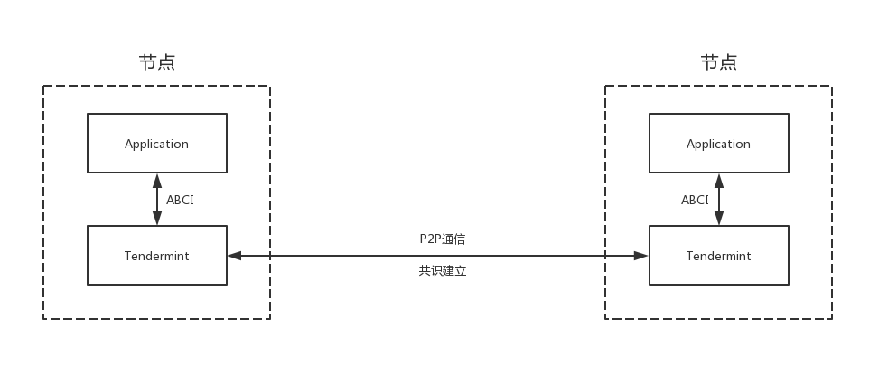
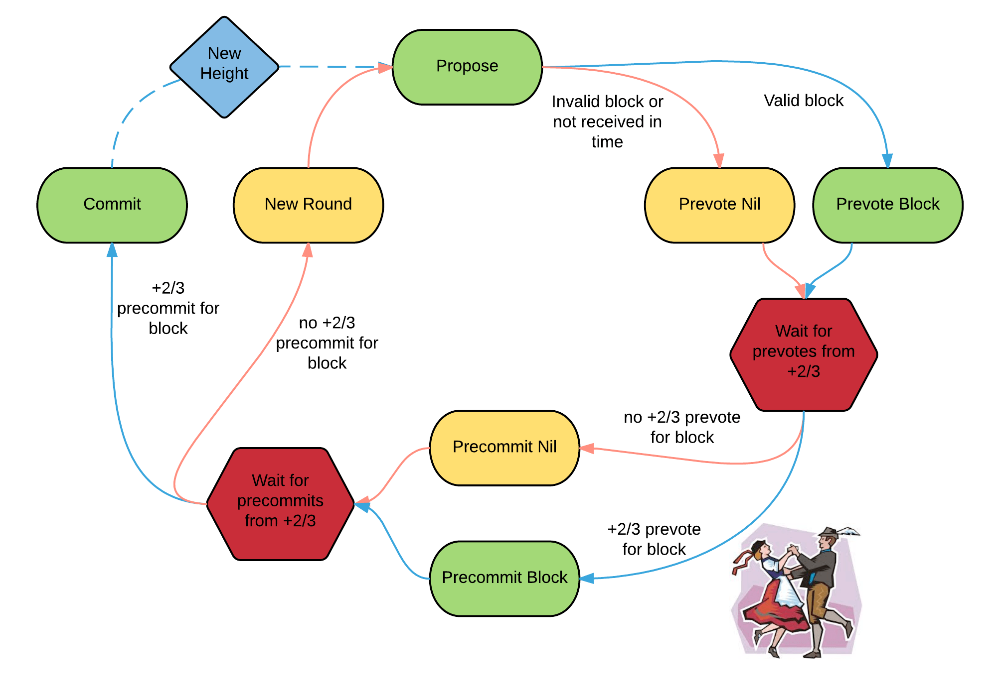
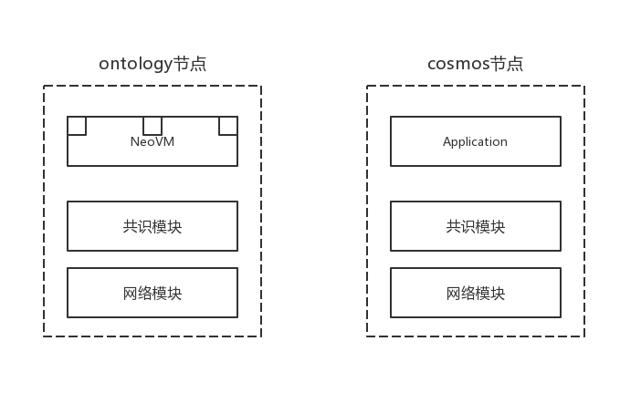
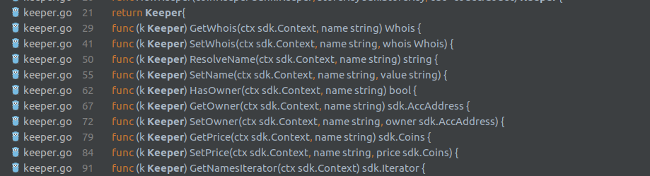
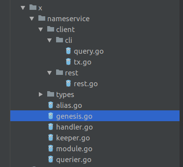
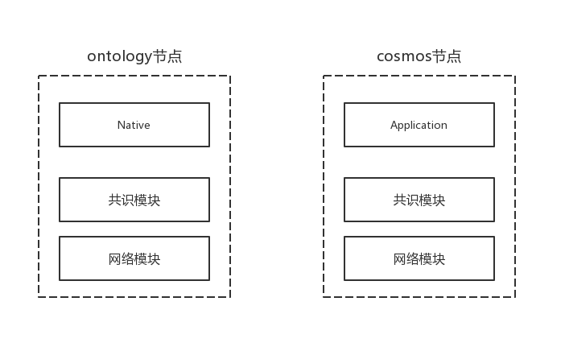

## Tendermint ABCI

tendermint是一个开源的完整的区块链实现，可以用于公链或联盟链，其官方定位是面向开发者的区块链共识引擎。

tendermint的SDK中包含了构造一个区块链节点旳绝大部分组件，例如加密算法、共识算法、 区块链存储、RPC接口、P2P通信等等，开发人员只需要根据其应用开发接口 （Application Blockchain Communication Interface）的要求实现自己 的应用即可。

ABCI是开发语言无关的，开发人员可以使用自己喜欢的任何语言来开发基于tendermint的 专用区块链。不过由于tendermint本身是采用go语言开发的，因此用go开发ABCI应用的一个额外好处就是，你可以把tendermint完整的嵌入自己的应用，干净利落地交付一个单一的可执行文件。



ABCI 包含了 3 个主要的消息类型，它们由 core 发送至应用，应用会对消息产生相应的回复: 

`DeliverTx `消息是应用的主要部分。链中的每笔交易都通过这个消息进行传送。应用需要基于当前状态，应用协议，和交易的加密证书上，去验证接收到 DeliverTx 消息的每笔交易，。一个经过验证的交易然后需要去更新应用状态 – 比如通过将绑定一个值到键值存储，或者通过更新 UTXO 数据库。 

`CheckTx` 消息类似于 DeliverTx，但是它仅用于验证交易。Tendermint Core 的内存池首先通过 CheckTx 检验一笔交易的有效性，并且只将有效交易中继到其他节点。比如，一个应用可能会检查在交易中不断增长的序列号，如果序列号过时，CheckTx 就会返回一个错误。又或者，他们可能使用一个基于容量的系统，该系统需要对每笔交易重新更新容量。 

`Commit` 消息用于计算当前应用状态的一个加密保证（cryptographic commitment），这个加密保证会被放到下一个区块头。这有一些比较方便的属性。现在，更新状态时的不一致性会被认为是区块链的分支，分支会捕获所有的编程错误。这同样也简化了保障轻节点客户端安全的开发，因为 Merkel-hash 证明可以通过在区块哈希上的检查得到验证，区块链哈希由一个 quorum 签署。 

```go
// Application is an interface that enables any finite, deterministic state machine
// to be driven by a blockchain-based replication engine via the ABCI.
// All methods take a RequestXxx argument and return a ResponseXxx argument,
// except CheckTx/DeliverTx, which take `tx []byte`, and `Commit`, which takes nothing.
type Application interface {
	// Info/Query Connection
	Info(RequestInfo) ResponseInfo                // Return application info
	SetOption(RequestSetOption) ResponseSetOption // Set application option
	Query(RequestQuery) ResponseQuery             // Query for state

	// Mempool Connection
	CheckTx(tx []byte) ResponseCheckTx // Validate a tx for the mempool

	// Consensus Connection
	InitChain(RequestInitChain) ResponseInitChain    // Initialize blockchain with validators and other info from TendermintCore
	BeginBlock(RequestBeginBlock) ResponseBeginBlock // Signals the beginning of a block
	DeliverTx(tx []byte) ResponseDeliverTx           // Deliver a tx for full processing
	EndBlock(RequestEndBlock) ResponseEndBlock       // Signals the end of a block, returns changes to the validator set
	Commit() ResponseCommit                          // Commit the state and return the application Merkle root hash
}
```

一个应用可能有多个 ABCI socket 连接。Tendermint Core 给应用创建了三个 ABCI 连接：一个用于内存池广播时的交易验证，一个用于运行提交区块时的共识引擎，还有一个用于查询应用状态。 

很显然，在创建区块链时，应用的设计者需要非常小心地设计他们的消息处理，这个架构提供一个范例。下图阐释了通过 ABCI 的消息流： 


## 节点以及共识算法

节点分两种：能生成区块的节点（validator）和不能生成区块的节点。不能生成区块的节点，主要的工作是广播节点/区块等信息以及投票。Tendermint使用的是POS+BFT算法，具体流程如下：



协议中的参与者叫着 “验证人”（validator）。他们轮流对交易区块进行提议，并对这些区块进行投票。区块会被提交到链上，每一个块占据一个“高度”（height）。提交块可能会失败，如果失败，协议就会开始下一轮的提交，并且一个新的验证人会继续提交那个高度的区块。要想成功提交一个块，需要有两个阶段的投票：“预投票”（pre-vote）和“预提交”（pre-commit）。在同一轮提交中，只有超过 2/3 的验证人对同一个块进行了预提交，这个块才能被提交到链上。 

上图右下角有一对夫妇在跳波卡舞，因为验证人做的事情就像是在跳波卡舞。当超过 2/3 的验证人对同一个块进行了预投票，我们就把它叫做一个“波卡”（polka）。每一个预提交都必须被同一轮中的一个波卡所证明。 

由于一些原因，验证人可能在提交一个块时失败：当前提议者可能离线了，或者网络非常慢。Tendermint 允许他们证实一个验证人应该被跳过。在进行下一轮的投票前，验证人会等待一小段时间从提议者那里接收一个完整的提议块。这种对于超时的依赖，使得 Tendermint 成为了一个弱同步协议，而非一个异步协议。但是，协议的剩余部分都是异步的，只有在接收到超过 2/3 的验证人集合时，验证人才会采取下一步操作。Tendermint 能够简化的一个原因就是它使用了同样的机制来提交一个块和跳过直接进入下一轮。 

基于不到 1/3 的验证人是拜占庭节点的前提，Tendermint 保证了永远都不会违背其安全性 – 也就是说，验证人永远不会在同一高度提交冲突块。为了达到这一点，它引入了一些 “锁定”（locking）的规则，这些规则对流程图中的路径进行了模块化。一旦一个验证人预提交了一个块，它就被“锁定”在了那个块上。然后, 1.它必须为被锁定的那个块进行预投票。2. 只有在之后的轮中，有了那个块的一个波卡，它才能够解锁，并为一个新块进行预提交。

## P2P通信

### 多路连接

`MConnection` 是一种多路连接，它在一个TCP连接上支持多个独立的流。消息从单个sendRoutine发送，该例程循环选择语句，并发送ping、pong或一批数据消息。该批数据消息可能包括来自多个通道的消息。消息字节排队等待在各自的通道中发送，每个通道一次保存一条未发送的消息。从最近发送的字节与通道优先级的比率最低的通道中，一次选择一批消息。

send（chid，msg）是一个阻塞调用，等待msg成功排队等待具有给定ID字节chid的通道。

trysend（chid，msg）是一个非阻塞调用，如果队列未满，则使用给定的id字节chid将消息msg排队到通道中；否则立即返回false。

每个节点只有一个 `MConnection` 实例。

### 安全

Tendermint P2P协议使用基于Station-to-Station Protocol的认证加密方案。

每个节点生成一个ED25519密钥对，用作持久（长期）ID。

当两个节点建立TCP连接时，它们首先生成一个用于此会话的临时X25519密钥对，并互相发送各自的临时公钥。

https://github.com/tendermint/tendermint/tree/master/docs/spec/p2p

<https://tendermint.com/docs/tendermint-core/secure-p2p.html>

## Tendermint vs. Ontology



在上图中，tendermint结构中的abci应用和ontology结构中的智能合约，都是由用户代码实现的。 显然，ABCI应用大致与NeoVM+合约的组合相匹配。

在中，节点是一个整体，开发者提供的智能合约则运行在受限的虚拟机环境中；而在 tendermint中，并不存在虚拟机这一层，应用程序是一个标准的操作系统进程，不受任何的限制与约束 —— 听起来这很危险，但当你考虑下使用tendermint的目的是构建专有的区块链 时，这种灵活性反而更有优势了。

事实上，tendermint留下的应用层空间如此之大，以至于你完全可以在ABCI应用中实现一个EVM或者NeoVM，然后提供合约开发能力。

当然，ontology的Native合约也可以类似做到这点。

## Cosmos SDK

cosmos sdk实现了一个Application的框架，用户可以方便的插拔需要的模块，并开发自己的业务模块。

### 应用程序需求

你正在构建的应用程序的目标是让用户购买域名并为其设置解析的值。给定域名的所有者将是当前最高出价者。接下来，你将了解如何将这些简单需求转化为应用程序的设计。

### NewApplication

首先创建一个新的文件`./app.go`。这个文件是你区块链的核心。你不必实现ABCI接口。Cosmos SDK以`baseapp`的形式提供了它的实现样板。

```go
type nameServiceApp struct {
	*bam.BaseApp
	cdc *codec.Codec

	// Keys to access the substores
	keyMain          *sdk.KVStoreKey
	keyAccount       *sdk.KVStoreKey
	keyFeeCollection *sdk.KVStoreKey
	keyStaking       *sdk.KVStoreKey
	tkeyStaking      *sdk.TransientStoreKey
	keyDistr         *sdk.KVStoreKey
	tkeyDistr        *sdk.TransientStoreKey
	keyNS            *sdk.KVStoreKey
	keyParams        *sdk.KVStoreKey
	tkeyParams       *sdk.TransientStoreKey
	keySlashing      *sdk.KVStoreKey

	// Keepers
	accountKeeper       auth.AccountKeeper
	bankKeeper          bank.Keeper
	stakingKeeper       staking.Keeper
	slashingKeeper      slashing.Keeper
	distrKeeper         distr.Keeper
	feeCollectionKeeper auth.FeeCollectionKeeper
	paramsKeeper        params.Keeper
	nsKeeper            nameservice.Keeper

	// Module Manager
	mm *module.Manager
}
```

`baseapp`做了以下几点：

- 解码从Tendermint共识引擎接收到的交易。
- 从交易中提取messages并做基本的合理性校验。
- 将这些message路由到合适的模块使其被正确处理。注意`baseapp`并不了解你想要使用的具体模块。你要做的就是在`app.go`中声明这些模块，在接下来的教程中将会看到这些工作。`baseapp`仅实现了适用于任意模块的核心路由逻辑。
- 如果ABCI消息是`DeliverTx`的话就Commit。
- 帮助设置`BeginBlock`和`EndBlock`,这两种消息让你能定义在每个区块开始和结束时执行的逻辑。实际上，每个模块实现了各自的`BeginBlock`和`EndBlock`子逻辑，app的职责是它们都聚合起来。（注意：你不会在你的应用程序中使用这些消息）
- 帮助初始化你的state。
- 帮助设置queries。

### New module

Cosmos SDK模块的主要核心是名为`Keeper`的部分。它处理同存储的交互，引用其他的keeper进行跨模块的交互，并包含模块的大部分核心功能。

首先创建文件`./x/nameservice/keeper.go`来保存模块的keeper。在Cosmos SDK应用程序中，模块通常放在`./x/`文件夹中。

```go
// Keeper maintains the link to data storage and exposes getter/setter methods for the various parts of the state machine
type Keeper struct {
	coinKeeper bank.Keeper

	storeKey sdk.StoreKey // Unexposed key to access store from sdk.Context

	cdc *codec.Codec // The wire codec for binary encoding/decoding.
}
```

关于上述代码的几点说明：

- 3个不同的`Cosmos`包被引入： 
  -  [`codec`](https://godoc.org/github.com/cosmos/cosmos-sdk/codec) : 提供负责Cosmos编码格式的工具——[Amino](https://github.com/tendermint/go-amino)。
  -  [`bank`](https://godoc.org/github.com/cosmos/cosmos-sdk/x/bank) : `bank`模块控制账户和转账。
  -  [`codec`](https://godoc.org/github.com/cosmos/cosmos-sdk/types) : `types`包含了整个SDK常用的类型。

* `Keeper`结构体。在keeper中有几个关键部分： 
  *  [`bank.Keeper`](https://godoc.org/github.com/cosmos/cosmos-sdk/x/bank#Keeper) : 这是`bank`模块的`Keeper`引用。包括它来允许该模块中的代码调用`bank`模块的函数。
  *  [`*codec.Codec`](https://godoc.org/github.com/cosmos/cosmos-sdk/codec#Codec) : 这是被Amino用于编码及解码二进制机构的编码解码器的指针。
  *  [`sdk.StoreKey`](https://godoc.org/github.com/cosmos/cosmos-sdk/types#StoreKey) : 通过它来访问一个持久化保存你的应用程序状态的`sdk.KVStore`。

Setter和Getter：



### Msg和Handler

`Msg`触发状态转变。`Msgs`被包裹在客户端提交至网络的`Txs`中。Cosmos SDK从`Txs`中打包和解包来自`Msgs`，这就意味着，作为一个应用开发者，你只需要去定义`Msgs`。`Msgs`必须要满足下面的接口:

```go
// Transactions messages must fulfill the Msg
type Msg interface {
    // Return the message type.
    // Must be alphanumeric or empty.
    Type() string

    // Returns a human-readable string for the message, intended for utilization
    // within tags
    Route() string

    // ValidateBasic does a simple validation check that
    // doesn't require access to any other information.
    ValidateBasic() Error

    // Get the canonical byte representation of the Msg.
    GetSignBytes() []byte

    // Signers returns the addrs of signers that must sign.
    // CONTRACT: All signatures must be present to be valid.
    // CONTRACT: Returns addrs in some deterministic order.
    GetSigners() []AccAddress
}
```

`Handler`定义了在接收到一个特定`Msg`时，需要采取的操作（哪些存储需要更新，怎样更新及要满足什么条件）。

在此模块中，你有两种类型的`Msg`，用户可以发送这些`Msg`来和应用程序状态进行交互：`SetName`和`BuyName`。它们各自同其`Handler`关联。

```go
// MsgBuyName defines the BuyName message
type MsgBuyName struct {
    Name string
    Bid    sdk.Coins
    Buyer  sdk.AccAddress
}

// NewMsgBuyName is the constructor function for MsgBuyName
func NewMsgBuyName(name string, bid sdk.Coins, buyer sdk.AccAddress) MsgBuyName {
    return MsgBuyName{
        Name: name,
        Bid:    bid,
        Buyer:  buyer,
    }
}

// Type Implements Msg.
func (msg MsgBuyName) Route() string { return "nameservice" }

// Name Implements Msg.
func (msg MsgBuyName) Type() string { return "buy_name" }

// ValidateBasic Implements Msg.
func (msg MsgBuyName) ValidateBasic() sdk.Error {
    if msg.Buyer.Empty() {
        return sdk.ErrInvalidAddress(msg.Buyer.String())
    }
    if len(msg.Name) == 0 {
        return sdk.ErrUnknownRequest("Name cannot be empty")
    }
    if !msg.Bid.IsPositive() {
        return sdk.ErrInsufficientCoins("Bids must be positive")
    }
    return nil
}

// GetSignBytes Implements Msg.
func (msg MsgBuyName) GetSignBytes() []byte {
    b, err := json.Marshal(msg)
    if err != nil {
        panic(err)
    }
    return sdk.MustSortJSON(b)
}

// GetSigners Implements Msg.
func (msg MsgBuyName) GetSigners() []sdk.AccAddress {
    return []sdk.AccAddress{msg.Buyer}
}
```

```go
// NewHandler returns a handler for "nameservice" type messages.
func NewHandler(keeper Keeper) sdk.Handler {
    return func(ctx sdk.Context, msg sdk.Msg) sdk.Result {
        switch msg := msg.(type) {
        case MsgSetName:
            return handleMsgSetName(ctx, keeper, msg)
        case MsgBuyName:
            return handleMsgBuyName(ctx, keeper, msg)
        default:
            errMsg := fmt.Sprintf("Unrecognized nameservice Msg type: %v", msg.Type())
            return sdk.ErrUnknownRequest(errMsg).Result()
        }
    }
}
```

```go
// Handle MsgBuyName
func handleMsgBuyName(ctx sdk.Context, keeper Keeper, msg MsgBuyName) sdk.Result {
    if keeper.GetPrice(ctx, msg.Name).IsAllGT(msg.Bid) { // Checks if the the bid price is greater than the price paid by the current owner
        return sdk.ErrInsufficientCoins("Bid not high enough").Result() // If not, throw an error
    }
    if keeper.HasOwner(ctx, msg.Name) {
        _, err := keeper.coinKeeper.SendCoins(ctx, msg.Buyer, keeper.GetOwner(ctx, msg.Name), msg.Bid)
        if err != nil {
            return sdk.ErrInsufficientCoins("Buyer does not have enough coins").Result()
        }
    } else {
        _, _, err := keeper.coinKeeper.SubtractCoins(ctx, msg.Buyer, msg.Bid) // If so, deduct the Bid amount from the sender
        if err != nil {
            return sdk.ErrInsufficientCoins("Buyer does not have enough coins").Result()
        }
    }
    keeper.SetOwner(ctx, msg.Name, msg.Buyer)
    keeper.SetPrice(ctx, msg.Name, msg.Bid)
    return sdk.Result{}
}
```

首先确保出价高于当前价格。然后，检查域名是否已有所有者。如果有，之前的所有者将会收到`Buyer`的钱。

如果没有所有者，你的`nameservice`模块会把`Buyer`的资金“燃烧”（即发送到不可恢复的地址）。

如果`SubtractCoins`或`SendCoins`返回一个非空错误，handler会抛出一个错误，回退状态转变。没有的话，使用之前在`Keeper`上定义的getter和setter，handler将买方设置为新所有者，并将新价格设置为当前出价。

## 其他



开发者新建模块需要完成的所有文件。

## Cosmos vs. Ontology


